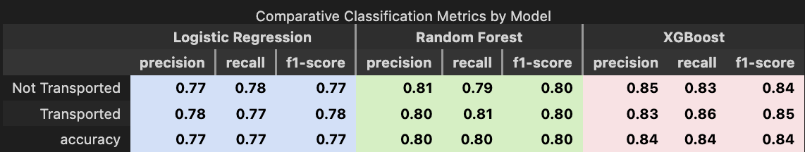

# Predicting Passenger Survival on the Spaceship Titanic 🚀🚢

#### QTM 347 Final Project
#### Team Members: Joyce Chen, Ryan Paik, Heyi Yang, Charlotte Zhao
#### Data Source: https://www.kaggle.com/competitions/spaceship-titanic
#### Final Presentation Slides: [Presentation Slides](https://www.figma.com/deck/KUwBVM5JqRcsdHktBC81Ek/QTM347-Project?node-id=1-303&t=g56ZEZevNkbWl1mv-1)

## Abstract
This project uses supervised classification models (Logistic Regression, Random Forests, and XGBoost) to predict passenger survival on the Spaceship Titanic. The key objective of this binary classification task is to determine whether a passenger was “transported” safely to another dimension based on demographic, financial, and behavioral features. The three models are evaluated based on their predictive performance and interpretability. Preprocessing steps include handling missing data, feature encoding, and normalization. Model performance is scored using cross-validation and metrics such as accuracy, precision, recall, and F1-score. Results highlight the trade-offs between model complexity and interpretability, with XGBoost achieving the highest overall accuracy, while Logistic Regression offers greater transparency in feature influence. Our findings demonstrate the effectiveness of ensemble methods for complex classification tasks and emphasize the importance of model selection in data-driven decision-making.

---

## Introduction
In the distant future—perhaps the year 2912—the Spaceship Titanic, a luxury interstellar vessel carrying over 13,000 passengers to newly discovered exoplanets, encountered a hidden spacetime anomaly near Alpha Centauri. Though the ship itself remained intact, nearly half its passengers mysteriously vanished, seemingly transported to an alternate dimension. This project aims to solve a crucial part of that mystery: using recovered records from the ship’s damaged computer system, we seek to predict which passengers were transported. Accurately identifying these individuals would assist interstellar rescue teams in resource allocation and possibly enable the development of anomaly-avoidance protocols for future missions.

The motivation for our project lies in the broader challenge of building robust, interpretable models that can perform well under uncertainty and imperfect data conditions. The Spaceship Titanic dataset simulates real-world scenarios where data may be incomplete, noisy, or corrupted, mirroring challenges in fields such as emergency response, fraud detection, and medical diagnostics. As such, this problem provides a compelling testing ground for machine learning methods that can inform decision-making when stakes are high and data reliability is limited.

To tackle this problem, we propose a comparative modeling framework using logistic regression, random forest, and XGBoost. Each model was chosen for its unique strengths: logistic regression offers interpretability and serves as a transparent baseline; random forest handles non-linear relationships and is robust to noise and missing values—ideal for data corrupted during transmission; XGBoost is a state-of-the-art boosting algorithm known for its predictive accuracy and built-in handling of complex feature interactions. These models align well with the classification task and offer complementary trade-offs in terms of performance and interpretability.

Our approach differs from many existing solutions that often prioritize accuracy alone. While previous studies or Kaggle submissions may rely on ensemble stacking or complex pipelines to maximize leaderboard scores, we deliberately emphasize model clarity and comparative insights. We aim to understand why certain models perform better and how features influence prediction, especially in the presence of uncertainty and missing data.

The key components of our approach include careful preprocessing, meaningful feature engineering (e.g., aggregating spending patterns, extracting cabin and group structure), and standardized evaluation using cross-validation and accuracy metrics. Our results demonstrate that while XGBoost achieves the highest accuracy, logistic regression provides valuable interpretability, and random forest strikes a balance between the two. However, our approach is not without limitations, particularly in the potential for overfitting with more complex models and the challenge of dealing with high-cardinality categorical features. Despite these, our framework offers a principled, flexible methodology for predictive modeling in uncertain environments.

---

## Setup
In this competition, our task is to predict whether a passenger was transported to an alternate dimension during the Spaceship Titanic's collision with the spacetime anomaly. From the damaged computer system (Kaggle dataset), we have two main components: a training set of 8,694 passengers whose transport status is known, and a test set of 4,278 passengers to predict. The datasets contain information about passengers aboard the Spaceship Titanic, with each row representing an individual. 

### Key Features
- Identifiers: PassengerID - Embeds group information, and Cabin, which reflects physical location on the ship (Deck/Num/Side)
- Demographics: HomePlanet, Age, and VIP status
- Behavioral features: participation in CryoSleep, as well as expenditures in RoomService, FoodCourt, ShoppingMall, Spa, and VRDeck
- Travel route: indicated by the Destination
- Target variable: Transported, a binary label indicating whether a passenger was mysteriously transported to another dimension

### Feature Engineering
- TotalSpending: a composite measure aggregating spending across all onboard services to capture engagement level
- Cabin decomposition into CabinDeck, CabinNum, and CabinSide to account for all possible location-based effects
- Group extraction from PassengerId to define Group and NumberInGroup
- TravelingAlone: A derived binary feature indicating whether the passenger is part of a multi-person group

### Data Exploration

  
  
  

Figure 1: Age Distribution of Passengers
The age distribution is right-skewed, with a concentration of passengers in the 20–30 age range. This suggests a relatively young traveler population. From a feature engineering perspective, age might correlate with passenger behavior (e.g., CryoSleep participation or spending). We may also consider creating age bands (e.g., youth, adult, senior) to capture non-linear effects and reduce model noise.

Figure 2: Total Spending Distribution Among Passengers
Total spending is strongly centered at zero, indicating many passengers did not spend money, possibly due to being in CryoSleep. The long tails reflect a few high spenders. This variable is informative but skewed. So, we decided to engineer this feature as a composite of multiple spending categories, making it a valuable summary indicator of onboard activity.

Figure 3: Passenger Transport Status by HomePlanet
HomePlanet is a strong categorical feature with clear class separation. Passengers from Europa show a higher proportion of being transported than those from Earth. This suggests underlying planet-based heterogeneity in outcomes, making HomePlanet a crucial input to model classification. One-hot encoding of this feature preserves this discriminatory power.

### Association Analysis

<figure style="text-align: center;">
  
</figure>

This plot informs our feature selection strategy by quantifying the relationship between each engineered feature and the target variable, Transported. The strongest associations are observed with Group, CabinNum, and CryoSleep, validating the decision to engineer features such as group identifiers (Group, NumberInGroup), cabin decomposition (CabinDeck, CabinSide, CabinNum), and binary indicators like CryoSleep and TravelingAlone.

Variables like RoomService, Spa, and VRDeck have very low or even negative correlations. This means that variables related to spending lack predictive value; therefore, we chose to transform these features and put less emphasis on them for feature selection. Overall, the association plot supports spatial, behavioral, and grouping-based features in our final model pipeline. 

---

## Modeling Approaches

We evaluate 3 classification models:

**1. Logistic Regression**
Serves as a simple, interpretable linear baseline.
- Parameters: max_iter=1000, C=1.0 (L2 regularization)

**2. Random Forest**
A robust ensemble method capable of capturing non-linear relationships.
- Tuned parameters: n_estimators, max_depth, min_samples_split

**3. XGBoost**
A gradient boosting model optimized for performance on tabular data.
- Handles missing values natively and includes built-in regularization
- Tuned parameters: learning_rate, n_estimators, max_depth

All models are trained within a unified scikit-learn Pipeline, which standardizes preprocessing and ensures consistent evaluation:
- Numerical features: Transformed using PowerTransformer and StandardScaler
- Categorical features: Imputed with a constant value and one-hot encoded using OneHotEncoder

### Model #1: Logistic Regression

<figure style="text-align: center;">
  
</figure>

This plot displays the 20 most influential features in the logistic regression model based on their coefficient magnitudes, indicating their effect on the log-odds of a passenger being transported.

Key Positive Predictors (Green Bars):

num__TotalSpending is the strongest positive predictor, suggesting that passengers who spent more on onboard services were significantly more likely to be transported.
Categorical indicators such as CryoSleep_True, HomePlanet_Europa, and cabins on decks C, B, and F are also associated with a higher likelihood of transportation. These may proxy for lifestyle or class-related factors onboard.
Key Negative Predictors (Red Bars):

CryoSleep_False is the most negative predictor, consistent with the positive effect of being in CryoSleep. This reinforces its importance in the model.
Spending-related features such as RoomService, Spa, and VRDeck have negative coefficients—likely because they are inversely related to CryoSleep status (i.e., sleepers do not spend).
Other negative contributors include passengers from Earth and Mars and those in CabinDecks A and G, suggesting some location and origin effects.

This plot provides strong interpretability benefits, revealing that behavioral (spending, CryoSleep), geographic (HomePlanet), and locational (CabinDeck) features drive logistic model predictions. It also highlights feature redundancy (e.g., both CryoSleep_True and CryoSleep_False appear), which is useful for understanding the symmetric nature of one-hot encoded features.

### Model #2: Random Forest

<figure style="text-align: center;">
  
</figure>

Root Node: CryoSleep = False
- First and most important split in the tree
- Passengers in CryoSleep are more likely to be transported

Left Subtree: CryoSleep = True → Likely Transported
- CabinDeck_B <= 0.5: Lower decks may be associated with higher risk
- HomePlanet_Mars <= 0.5: Passengers not from Mars had higher transport rates
- VIP_True <= 0.5: Non-VIPs are more likely to be transported
- Destination = TRAPPIST-1e or PSO J318.5-22: Certain destinations linked to transport

Right Subtree: CryoSleep = False → Less Likely Transported
- Spa <= 1.57 and TotalSpending <= 2.37: Low spending linked to non-transport
- Age <= -1.13: Younger passengers are slightly more likely to be transported
- CabinSide_S <= 0.5, Destination_TRAPPIST-1e <= 0.5: Additional location-based distinctions

### Model #3: XG Boost

<figure style="text-align: center;">
  
</figure>

This figure shows the top 10 features ranked by their average information gain in the XGBoost model. CryoSleep_False dominates the other features as the most important feature, which  confirms that a passenger not in CryoSleep is a strong indicator of not being transported. HomePlanet_Earth and HomePlanet_Europa follow, suggesting the passenger’s origin plays a significant role in their transport likelihood, likely due to differing population traits or behaviors. CabinSide_S also contributes meaningfully, reinforcing spatial location aboard the ship as a predictive feature. Spending-related variables like RoomService, TotalSpending, and Spa are also pretty valuable, indicating that passenger engagement with onboard amenities relates to transport status. The inclusion of CabinDeck_F and CabinDeck_E implies that deck-level information helps refine predictions, likely due to location-based differences in exposure to the anomaly. XGBoost’s reliance on behavioral features (e.g., spending), spatial indicators (e.g., cabin location), and CryoSleep status suggests that it captures both individual activity patterns and environmental context. These findings validate earlier feature engineering choices and support their inclusion in all model pipelines. The gain metric here emphasizes not just the frequency of use, but how impactful the feature was in reducing classification error.

---

## Results

### **Main Results**
We evaluated three supervised classification models — **Logistic Regression**, **Random Forest**, and **XGBoost** — to predict whether passengers aboard the Spaceship Titanic were transported to another dimension. See file submission for the list of predicted passengers being transported. All models demonstrated strong generalization performance under 5-fold cross-validation, with XGBoost outperforming the others on the validation set:

- **Logistic Regression**  
  - Cross-Validation Accuracy: **77.3% ± 0.0065**  
  - Validation Accuracy: **77.5%**  
  - Despite its simplicity, logistic regression achieved reliable performance and serves as a highly interpretable baseline.

- **Random Forest**  
  - Best Cross-Validation Accuracy: **80.2%**  
  - Validation Accuracy: **80.16%**  
  - Able to capture non-linearities and variable interactions, Random Forest consistently outperformed logistic regression.

- **XGBoost**
  - Best Cross-Validation Accuracy: **80.04% ± 0.00107**
  - Validation Accuracy: **84.36%**
  - Achieved the highest validation accuracy, suggesting superior generalization. XGBoost's ability to model complex feature interactions with regularization led to the most accurate predictions.

- **Classification Metrics**
<figure style="text-align: center;">
  
</figure>

Accuracy Trends:
- XGBoost achieves the highest accuracy at 0.84, followed by Random Forest (0.80) and Logistic Regression (0.77). This confirms that more complex, non-linear models better capture the underlying structure in the dataset.

Class-Wise Performance:
- All models show balanced performance across the two classes ("Not Transported" and "Transported"). XGBoost slightly favors "Transported" predictions, with higher recall (0.86) and f1-score (0.85) for that class. Logistic Regression, while the simplest, still maintains strong baseline metrics and is likely more interpretable.

Model Preference:
- XGBoost should be preferred if prediction accuracy is the priority. Random Forest provides strong performance with less tuning and better interpretability than XGBoost. Logistic Regression is best when explainability and computational efficiency are crucial.

### **Supplementary Results and Parameter Choices**

Each model was tuned using appropriate hyperparameters and preprocessing strategies: 

- **Logistic Regression**
  - `max_iter = 1000`
  - `C = 1.0` (default L2 regularization)
  - Preprocessing:
    - Numerical: `PowerTransformer` → `StandardScaler`  
    - Categorical: `OneHotEncoder`

- **Random Forest (via GridSearchCV)**
  - `n_estimators = 200`
  - `max_depth = 10`
  - `min_samples_split = 5`
  - `min_samples_leaf = 1`

- **XGBoost (via GridSearchCV)**
  - `n_estimators = 200`
  - `max_depth = 3`
  - `learning_rate = 0.2`
  - `subsample = 1.0`

These parameters were selected through 5-fold cross-validation to balance performance (bias) and generalization (variance). Notably, limiting tree depth in XGBoost and adjusting the learning rate allowed for better regularization, helping it outperform Random Forest despite similar CV scores. 

---

## Conclusion: 
In this project, we predicted whether passengers aboard the Spaceship Titanic were transported. Using a dataset of demographic, behavioral, and financial features, we applied and compared Logistic Regression, Random Forest, and XGBoost models. To maximize the use of these models, we also conducted extensive preprocessing, including missing value imputation, feature transformation, and encoding, which was important to our pipeline.

While Logistic Regression provided a strong interpretable baseline, the ensemble-based models demonstrated superior performance. Ultimately, XGBoost emerged as the top performer, achieving the highest accuracy and F1-scores across both classes. Our results emphasize the effectiveness of tree-based ensemble methods in handling structured, feature-rich datasets.

This project demonstrates the importance of feature engineering, model tuning, and comparative analysis in predictive modeling tasks. Beyond the scope of this competition, the approaches we used can be expanded onto real-world subjects such as transportation, security screening, or emergency triage—any setting where timely and accurate classification of individuals is essential.

---

## Discussion: 
Even though our models achieved relatively strong predictive performance, there were definitely some limitations to our approaches and areas for future improvement. Regarding some basic data assumptions, there was a large portion of the dataset that had missing values, specifically in key features like Age, Cabin, and other spending-related categories. Despite the imputation techniques we used in preprocessing, it may not have been able to fully capture necessary patterns. A plausible fix for this in future work could be to implement more advanced imputation methods, such as iterative imputation or deep generative models. Another notable drawback was the redundancy of some of our features. When it came to correlation, there could have been collinearity between original variables and the derived features (e.g., TravelingAlone, TotalSpending). Not to mention, the dataset lacked overall contextual order as the topic is quite abstract and not necessarily applicable to a super realistic setting. 

However, we still believe the implications of our work extend beyond this specific dataset. The modeling techniques and feature engineering strategies used here can be adapted for real-world scenarios, particularly in emergency response or rescue operations. For example, similar models could assist in identifying missing individuals following natural disasters or shipwrecks by learning from structured passenger data. The ability to rapidly and accurately predict survival likelihoods could support prioritization in rescue missions, ultimately saving lives.

---

## References: 
Eunicl. "Spaceship Titanic with Random Forest + XGBoost." Kaggle, 2023, https://www.kaggle.com/code/eunicl/spaceship-titanic-with-random-forest-xgboost.
Dilber, Burak. "Spaceship Titanic - EDA, Preprocessing and XGBoost." Kaggle, 2023, https://www.kaggle.com/code/burakdilber/spaceship-titanic-eda-preprocessing-and-xgboost.

